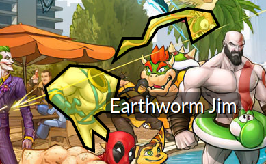

# Architecture

#### Getting *something* out instead of nothing

BusyImg (busyimg.com) is a simple and fun site to display images with many details and annotations so users can inspect them. The image [Another Night at the Warp Core Cafe](https://busyimg.com/i/warp-core-cafe) by [Jeff Carlisle](http://jeffcarlisle.com/) is an example image that inspired me to write this app. 

All the functionality needed for a normal user browsing the site can be handled using static webpages. The architecture questions then relate to the tooling to generate the content.

This architecture described below is a series of compromises to get this small project out into production with a limited time investment--cut scope or never release it. Ideally many of these decisions can be improved as needed, but is a good-enough-for-now solution. 


### Content Pipeline
For generation of content, there must be some way to authenticate users, upload content, and annotate it. Additionally, it would need some type of curation process to gate inappropriate and possibly illegal content. 

#### Option #1: Online Tooling
In an ideal workflow a user could easily log in to the website with a single-signon solution, upload/link an image, and add start annotations. 

* *Authorization: Single-Signon* (ex. Google OpenID)
    * pro: trivial to login
    * con: requires a dynamic web server (easy to setup)
* *Storage: Database* - some type of file- and/or datastore hold both the uploaded images and their annotations
    * pro: flexibility for real-time changes without relaunching server
    * con: requires database, schema design, boilerplate API
* *Tooling: Live Editor* - HTML workflow for loading images, drawing annotations using some process like painting-by-pixel or wrapping in shape
    * pro: very accessible
    * con: larger scope to create a UX and API to interface with database
* *Curation: Live Curator*
    * pro: ?
    * con: one more thing to write

The biggest appeal of online tooling is far greater accessibility for anyone that wants to contribute. 

#### Option #2: "Offline" Tooling
While none of the concepts in option 1 are necessarily hard, the scope of work for getting one of them out may be more work than the entire offline approach. This is a huge factor for a small project that may otherwise never get released given other personal commitments. 

* *Authorization: Github*
    * pro: all authorization handled by 3rd-party
    * pro: no authorization code in the application
    * con: greatly limits contributors who do no have a Github account
* *Storage: Code*
    * pro: allows many offline validation tools
    * pro: easy to change/revert content in development without making any database changes
    * con: image shipped with production package; will eventually reach size limits on platforms like Heroku
    * con: server-side caching slower than CDN, possibly more expensive in some cases
    * alternative is S3 buckets, but requires more authorization and tooling to get images there
        * possibly good next step
* *Tooling: 3rd-party tools; scripts*
    * pro: limits scope of project MVP
    * pro: good existing tools (ex. image editors, shape editors)
    * con: requires workflow to ingest content
    * con: further barrier to contributing
* *Curation: Github*
    * pro: use PRs to curate contributions to both the site and content
    * con: curation/tooling require redeploy of application

There are some other sub-options such as using a separate repository for just the content, which might remove the need to redeploy the server on changes, but for the sake of scope that was punted. 

In the end option #2 was chosen to get something released. 

#### Offline Storage
With the images stored in the github repository, there needed some way to describe the annotations for a given image. BusyImg uses a very primitive metadata file format and naming convention in the content directory. 

Each "busyimg" has a corresponding directory, metadata file, and a file for each annotation. 

##### Directory Name
The name of the directory maps to the subpath where the image resides on the website. So the `pregen/some-image` directory would contain all the metadata to render busyimg.com/some-image. There is no manual mapping of this directory to a subpath. A script will build the necessary code the app will use for routing. 
* pro: simple 1-to-1 mapping of directory name to subpath
* con: ?

##### Metadata File
Each directory would contain a `metadata.json` file. This would provide the displayed title, creator, and link to the creator's website. 
* pro: JSON is easy to parse
* con: ?

##### Annotation File(s)
Also in each directory are several annotation files. 

The **name** of the file will be used for the label on the screen (ex. `pregen/wheres-walle/ABC Robot (Judge Dredd).areas` will have a label of `ABC Robot (Judge Dredd)`). The label can have special formatting based on a convention of the title (see example image above). 
* pro: simple mapping of filename to label
* con: operating-system limitations on filenames
* con: not practical for multiple language support

The approach was chosen for its simplicity--a focus in all these decisions--and easy retrofitting. Because I went with a shape-based approach contained in a text file, I would always augment that file structure later. 

* image-based solution
    * pro: pixel-perfect accuracy (given the effort)
    * con: longer annotation time
* shape-based approach
    * pro: consistent HTML area tags; familiar paradigm; almost automatic browser support. 
    * pro/con: suitable accuracy

While I went with the shape-based solution for storing annotations, there's nothing that prevents me from supporting the image-based solution as well some time in the future.  

The **contents** of each file ended up being a list of HTML area tags. I weighed this approach against an image-based solution. 

Example file for `ABC Robot (Judge Dredd)`:
```
<area target="" alt="Unknown 146" title="Unknown 146" href="" coords="912,253,912,265,923,263,929,277,933,289,933,
303,937,313,950,322,971,331,974,347,985,343,997,344,1005,348,1014,348,1019,329,1015,317,1020,298,1025,288,1030,295
,1033,306,1041,298,1051,293,1051,283,1053,272,1046,262,1056,260,1056,249,1048,236,1017,235,1012,226,1007,211,997,2
06,979,206,971,213,971,230,973,236,969,248,959,249,950,242" shape="poly">
```

While most annotation files held only one area tag, multiple shapes could be put into one file, which is helpful and/or required for some situations. 



##### Typescript Metadata
Possibly the weirdest approach to this architecture is mapping the image/annotation metadata above to Typescript. I was using Typescript for the client code anyway, and having the metadata stored in Typescript anyway provided a convenient way to validate any problems at build time. 
* pro: typescript metadata type-checked at build
* con: manual python script to do the conversion
    * a little flakey, but seems to work sufficiently well

#### Tooling
As mentioned above, the image subpath and metadata can be created using the file browser and file naming conventions. 

A python script called `process-content.py` can map a directory's metadata to a Typescript file including all its annotations. 

The annotations are stored in individual files contaning lines of HTML area tags. I wrote a simple script `areas-to-files.py` that maps a block of area-tag HTML lines to annotation files. While a little clunky its very simple to take a text-block of areas from any 3rd-party tool and create the annotation files. 

I wanted more flexibility in rendering the shapes in the actual UI so I ended up using an SVG instead of area tags, but the shapes themselves are stored in HTML area tags. This is convenient as many tools are available to create them (ex. https://www.image-map.net/). 

#### Curation
Because everything is stored in code and human-readable (for the most part, I guess creators can draw things with the annotation data) a Github pull-request can be used to gate any content going onto the site. Once approved and merged it will automatically be redeployed to the site. 

### Summary
The above is a quick and dirty list of technical decisions and compromises to get a simple idea into production. Future improvements might be required if many users start using and contribution to the site, but that's not the worse place to be. 